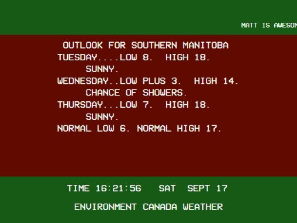
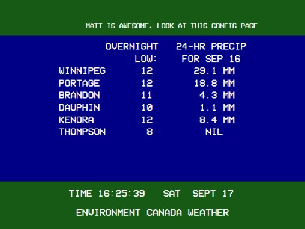
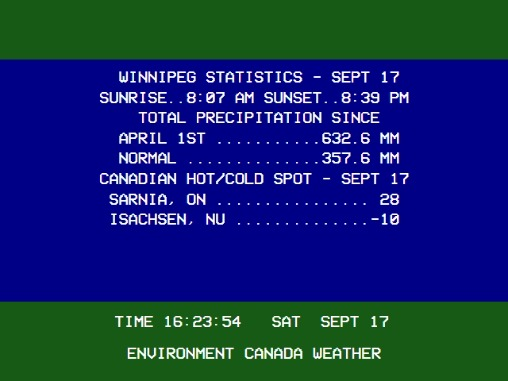
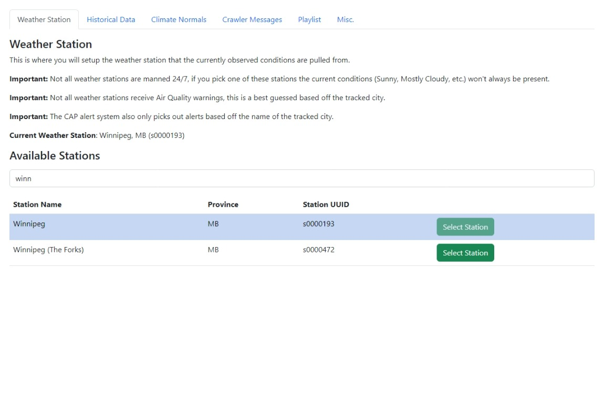

# Retro Environment Canada Weather Channel

This project is intended to be a loose recreation of the Environment Canada Weather Channel that was commonly found in Winnipeg in the 80s-90s. This is modeled after the 1995 version. This is the most accurate version of this you will find outside of the original weather channel.

All data for the weather channel is sourced from [Environment Canada](https://weather.gc.ca/).

Once up and running the weather channel will be accessible from your [browser](http://localhost:8600/#/).








## Current Features

- Air Quality readings
- Windchill
- Forecast (+ Current conditions)
- Outlook
- Almanac Data (Sunset/Rise, High/Low Temp Records, Last Year Temp)
- Alerts/Warnings/Watches
- High/Low/Precip for the day around the province of your choice (config coming soon)
- Latest Hourly Observation for various cities (Canada/US)
- Precipitation Amounts per season (Apr 1st - Sept 30th / Oct 1st - Mar 31st)
- Canada Hot/Cold Spots for the day
- Last month summary (first 5 days of month)
- Custom playlist
- Custom crawler messages for adverts/general info

## Planned Features

- Customizable screen rotation

## Requirements

To run this project you will need an internet connection and (at least) [Node v14.6.1](https://nodejs.org/en/download/).

NPM will be installed along with Node however I recommend using [Yarn](https://yarnpkg.com/) for this project.

Before continuing along with this guide make sure you run the following to install the project dependencies.

```
yarn install
```

## Starting the channel

Before you can configure the channel or even access the channel in your browser, you will need to start the server portion of the application. This is done by running the following command:

```
node backend.js
```

If sucessful you should see the following in your command prompt:

```
Generating crawler from ./cfg/crawl.txt...
Generating playlist from `music` folder...
[CONFIG] No config file found, loading defaults
[CONFIG] Configuration can be set via http://localhost:8600/#/config
[RECW] Application started, listening on http://localhost:8600
[ALERT MONITORING] Starting alert monitoring via AMQP...
[ALERT MONITORING] No stored alerts
Generated a playlist of 1 files...
Generated a crawler list of 2 messages
```

## Server Configuration

You can start the app without configuration if you want to setup a weather channel for Winnipeg, however if you want to customize where the weather channel is located you should head over to the configuration page.

http://localhost:8600/#/config



## Adding music to your channel

**retro-env-canada-weather-chan** supports adding a playlist of your choosing to be played whilst displaying the channel in the browser.

Playlist creation is done simply by placing `.mp3` files into a `music` folder in this root directory.

When you start the backend you will then see it check and generate a playlist for you based off of the files found in that directory.

The [config](http://localhost:8600/#/config) page has the option to reload the playlist without restarting the backend portion of the application.

```
Generating playlist from `music` folder...
Generated a playlist of 62 files...
```

## Adding crawler messages to your channel

**retro-env-canada-weather-chan** supports adding custom crawler messages along the top bar for adverts and general info.

Crawler messages can be added using the [config](http://localhost:8600/#/config) page and saving the crawler messages will force a reload on the channel within the next 5 minutes.

```
a small crawler message
a second small crawler message
```

When you start the backend you will then see it check and generate your crawler messages for you.

```
Generating crawler from ./cfg/crawl.txt...
Generated a crawler list of 2 messages
```

## Accessing the channel

### End-users

If you don't intend on doing any development for the project you you need to run the following

```
yarn build
```

Once this is done, you can navigate to the channel in your [browser](http://localhost:8600/) as instructed by your terminal window.

The output will fill your browser however the actual screen area will be limited to 640x480.

### Developers

Whilst doing any development for the project you can build (and serve) the frontend using the below command.

```
yarn serve
```

This will give you access to a hot-reloadable version of the weather channel in your [browser](http://localhost:8080/).
