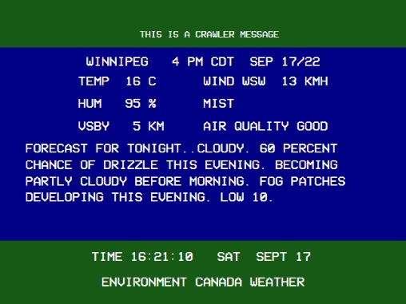
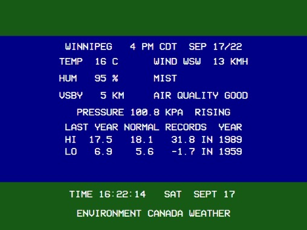

# Retro Environment Canada Weather Channel

This project is intended to be a loose recreation of the Environment Canada Weather Channel that was commonly found in Winnipeg in the 80s-90s. This is modeled after the 1995 version. I've tried to be as accurate as possible however there are still some tweaks that could be made to make them more true to life.

All data for the weather channel is sourced from [Environment Canada](https://weather.gc.ca/).

Once up and running the weather channel will be accessible from your browser.






## Current Features

- Current conditions
- Forecast
- Windchill
- Almanac Data (Sunset/Rise, High/Low Temp Records)
- Latest Hourly Observation for various cities
- Snowfall/Precipitation Amounts
- High/Low for the day around province of your choice (config coming soon)
- Weather Warnings
- Custom playlist
- Custom crawler messages for adverts/general info

## Missing Features

- Alerts
- Last Year temps on almanac

## Planned Features

- Customizable screen rotation

## Requirements

To run this project you will need an internet connection and (at least) [Node v14.6.1](https://nodejs.org/en/download/).

NPM will be installed along with Node however I recommend using [Yarn](https://yarnpkg.com/) for this project.

Before continuing along with this guide make sure you run the following to install the project dependencies.

```
yarn install
```

## Server Configuration

Before you can start the server you will need to run the setup file to select which Canadian location to pull your weather info from. You will be presented with a list of every location available, or you can use the `--search <town/city>` option to narrow down the results.

```
node setup.js [--search town/city]
```

Now that the server is configured you can run the backend component and the frontend will connect to this to retrieve relevant info.

```
node backend.js
```

If sucessful you should see the following in your command prompt:

```
Loading retro-envcan with primary location of <location> - <province>
Listening on 8600...
Navigate to http://localhost:8600/ in your browser
```

## Adding music to your channel

**retro-env-canada-weather-chan** supports adding a playlist of your choosing to be played whilst displaying the channel in the browser.

Playlist creation is done simply by placing `.mp3` files into a `music` folder in this root directory.

When you start the backend you will then see it check and generate a playlist for you based off of the files found in that directory.

```
Generating playlist from `music` folder...
Generated a playlist of 62 files...
```

## Adding crawler messages to your channel

**retro-env-canada-weather-chan** supports adding custom crawler messages along the top bar for adverts and general info.

This is done by creating a `crawl.txt` file in the `cfg` directory. These messages are loaded when the application starts and the data is sent to the channel when it is first loaded.

The `crawl.txt` supports an unlimited number of messages and all you have to do is add in one message per line

```
a small crawler message
a second small crawler message
```

When you start the backend you will then see it check and generate your crawler messages for you.

```
Generating crawler from ./cfg/crawl.txt...
Generated a crawler list of 2 messages
```

## Accessing the channel

### End-users

If you don't intend on doing any development for the project you you need to run the following

```
yarn build
```

Once this is done, you can navigate to the channel in your [browser](http://localhost:8600/) as instructed by your terminal window.

The output will fill your browser however the actual screen area will be limited to 640x480.

### Developers

Whilst doing any development for the project you can build (and serve) the frontend using the below command.

```
yarn serve
```

This will give you access to a hot-reloadable version of the weather channel in your [browser](http://localhost:8080/).
